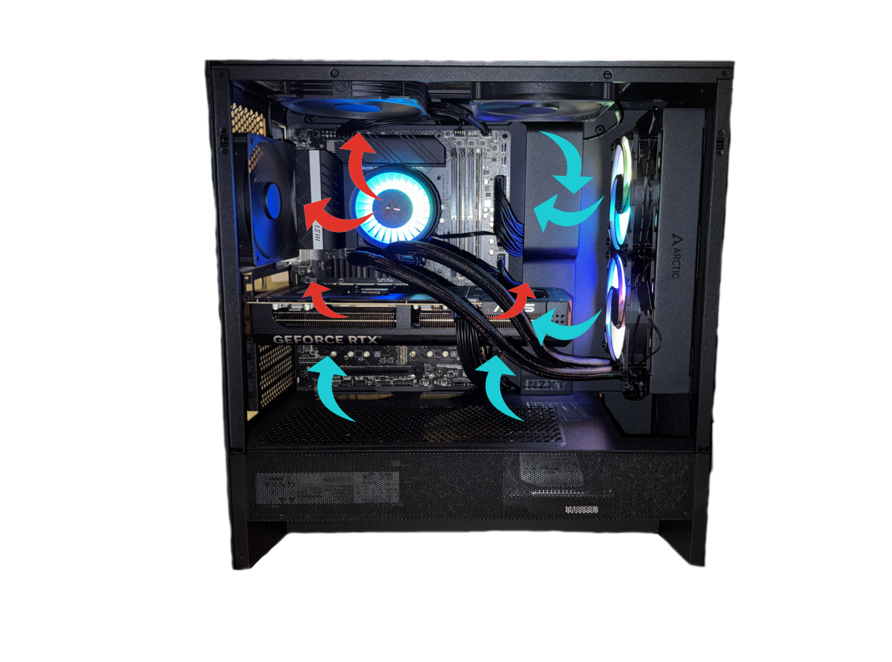

# System Architecture

## System Purpose

This system is built to perform as a secure, modular self hosted infrastructure for a variety of services. Its initial conception was for NAS purposes; significantly enhancing my filesystem accessibility without the need of cloud storage. 

When I was in my 2nd year in college I took an entry level physics course that I thoroughly enjoyed. I felt confident using the Apple ecosystem, using an iPad and Apple Pencil to take notes directly on the slides provided and storing them on iCloud where I presumed they would be safe. About one week before the Final exam, I open my notes to study and to my horror the folder that once contained about 22 powerpoint files full of a semester's worth of handwritten notes is empty, and the files; as if they never existed. All recovery attempts failed, and through research I discovered that iCloud is notoroious for randomly deleting files with dozens of complaints of people in arguably worse situations that I was. 

That moment was awakening; a clear example of how much control you give up using cloud servers and what the damage could be when things go wrong. I built this system to centralize my file access without needing to rely on cloud storage providors to retain full control and privacy of my data. As I continued to build the system its purpose began to evolve ... 

## Hardware

### Core internals

- MSI PRO Z690-A DDR4 ProSeries Computer Gaming Motherboard
- Intel Core i7 12700KF
- G.SKILL AEGIS Series (Intel XMP) DDR4 RAM 16GB (2x8GB) 3000MT/s CL16-18-18-38 1.35V
- CORSAIR RM750e (2025) Fully Modular ATX Power Supply, Gold Efficiency, 105°C-Rated Capacitors

### Graphics

- ASUS GeForce RTX™ 5070 Ti OC Edition 16GB
- MSI GeForce GTX 1660 8GB

### Storage

- Seagate IronWolf 8TB NAS Internal Hard Drive
- SAMSUNG 870 EVO SATA SSD 500GB 2.5” Internal Solid State Drive (x2)

## Core Technologies

- Debian Trixie (Headless)
- Docker Compose
- UFW Firewall
- Wireguard VPN
- Caddy Reverse Proxy
- Adguard DNS
- NVIDIA Container Toolkit

## Thermals and Cooling

This system is housed in a standard size computer tower, primarily built for ATX motherboards. There are three 120mm fans installed; two are installed at the top of the tower and one is installed on the back of the tower. On the top of the tower closes to the front the fan is oriented to act as an intake fan to bring in and circulate cool air. Next to it, the fan located at the top of the tower closest to the back is oriented to act as an exhaust fan. These orientations were chosen to allow unabstructed cool air to circulate through the case, and the exhaust fan on top is located right above the cpu pulling out the hot air produced by the CPU cooler. The back follows the same principle and pulls hot air out of the case. 

In addiation, this system using an ARTIC Liquid Freezer III AIO CPU cooler to ...

### AVERAGE TEMPS:

### CONCERNS: 

There is no fan purposed with circulating air throguh the drives which could potentially cause problems if there is heavy I/O operations. This is more troublesome considering that a 5070ti is exhausing air right over the drive's housing.

### DIAGRAM:

## Infrastructure Philosophy

## Security Overview

