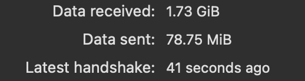

# Network Design

## Purpose

This document provides a high level overview of the network architecture. It describes how services communicate, how remote access is securely provided, and the methods used to minimize unncessary public exposure while maintaining usability, ease of use, and administrative flexibility.

## Network Design Principles

The infrastructure's network was designed around several core security principles:

- Default deny firewall policy
- Principle of least exposure
- VPN-first remote access
- Encrypted communication 
- Centralized HTTPS access through reverse proxy services
- Minimal direct host port exposure

## Network Topology

The infrastructure follows a centralized architecture with the server acting as the primary service host for all self-hosted applications. All services reside within the internal network and are designed around a VPN-first access model to minimize direct public exposure.

Containerized services are deployed using Docker and communicate through isolated Docker bridge networks or host networking where appropriate. Internal DNS resolution is handled by AdGuard Home, while Caddy provides centralized HTTPS reverse proxy functionality for web-based user interfaces or services.

## Secure Access Design

Remote access is primarily provided through WireGuard VPN. Once connected to the VPN, remote clients become members of a dedicated private network and may securely access internal services through internal DNS resolution and HTTPS reverse proxy endpoints. This design provides two layers of protection when accessing internal services. First, WireGuard encrypts all traffic traversing the VPN tunnel. Second, HTTPS provided by Caddy encrypts application traffic between the client and service endpoint. 

### WireGuard VPN Architecture

WireGuard provides secure remote access to the server by port forwarding a nonstandard port to the server. Authorized client devices establish encrypted tunnels to the server, allowing remote users to securely access self-hosted services as if they were locally connected.

The VPN infrastructure is implemented using native WireGuard tooling and manually maintained configuration files rather than third-party management platforms. Remote clients are assigned addresses from a dedicated WireGuard subnet, allowing secure communication with internal services while remaining logically separated from the primary LAN. This approach provides greater visibility into the underlying networking components, facilitates a deeper understanding of VPN operation, and retain direct administrative control over peer configuration and routing behavior.

WireGuard was selected due to its lightweight design, modern cryptographic implementation, low overhead, and broad cross-platform support.

### Internal DNS

AdGuard Home is deployed inside a docker container to act as the infrastructure's internal DNS server. It provides centralized internal domain name resolution through DNS rewrites while also blocking advertisements and trackers. This allows internal services to be accessed using hostnames rather than IP addresses; limiting internal service port exposure and enabling HTTPS connectivity.

### Reverse Proxy

Caddy serves as the centralized HTTPS reverse proxy for web-based services throughout the infrastructure also operating within a docker container. It utilizes an internally trusted certificate authority (CA) for internal service endpoints. Client devices trust this internal CA, allowing HTTPS connections without browser security warnings while avoiding unnecessary exposure to public certificate authorities. 

Caddy was selected because it simplifies TLS certificate management, provides straightforward configuration, has an officially maintained Docker image, and can remain entirely self hosted. This approach centralizes access management, simplifies certificate administration, and reduces direct exposure of backend services.

### Remote Access Workflow

To authorize a device, a WireGuard configuation file is created with a fresh key pair, then the public key is added to the server's WireGuard configuration file. Then inside the WireGuard application on the client device the configuratio file can be used through the "Import Tunnel from File" Option.

Once the configuration file is loaded into the WireGuard application, the tunnel can be established; granting access to the server and internal services. The simplest method to verify connectivity is to confirm that the WireGuard client is successfully transmitting and receiving data.

## Service Exposure Strategy

Services are exposed according to the principle of least exposure. Administrative and web-based services are generally accessed through a combination of WireGuard VPN, internal DNS resolution, and HTTPS reverse proxy endpoints provided by Caddy. Direct host port exposure is avoided where possible in order to reduce attack surface and centralize access management.

Certain services may intentionally deviate from this model when operational requirements or client compatibility considerations need alternative access methods. Such exceptions are evaluated on a case-by-case basis and remain restricted through VPN access and firewall controls.

For additional information regarding service exposure and published ports, see:
- `docker-containers.md`

## Docker Networking

Docker is used to provide service isolation and simplify application deployment. Most services are deployed on Docker bridge networks, allowing containers to communicate with each other internally without requiring every service port to be published directly on the host system.

Where possible, containers are accessed through internal Docker networking and routed through Caddy for HTTPS reverse proxy access. This reduces unnecessary host-level port exposure and allows web-based services to be managed through a more centralized access path.

## Firewall Interaction

The firewall acts as an additional enforcement layer between the host system, local network, VPN clients, and exposed services. Firewall rules are designed to support the VPN-first access model by denying inbound access by default and allowing required traffic for approved services.

UFW is used to manage host-level firewall policy. Access to administrative services is restricted where possible, with trusted access paths prioritized through WireGuard.

The Firewall policy works alongside Docker networking, Caddy, and WireGuard to secure the network of the server. Docker controls container-level connectivity, Caddy centralizes HTTPS service access, WireGuard provides encrypted remote access, and the firewall enforces which traffic is permitted to reach the host and services.

## Network Diagrams

The following diagram illustrates the physical network layout and communication paths between infrastructure components.

### Network Architecture

The following diagram illustrates how users securely access internal services from both local and remote networks.

### Secure Service Access
